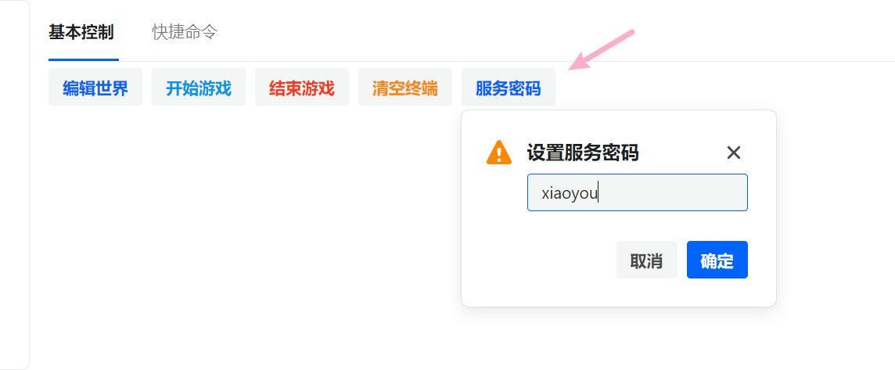
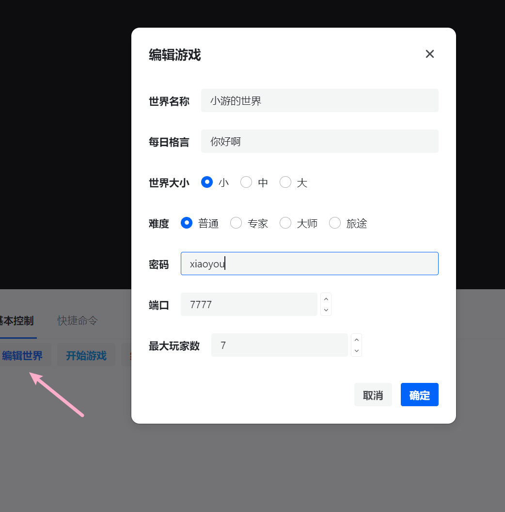
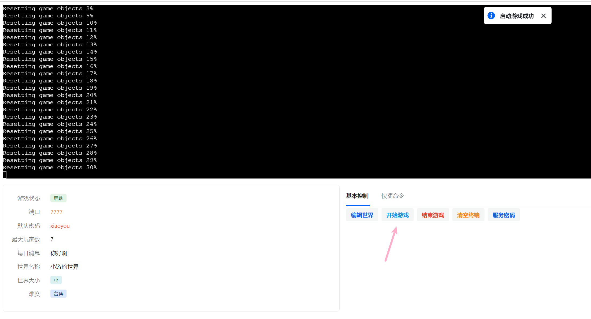
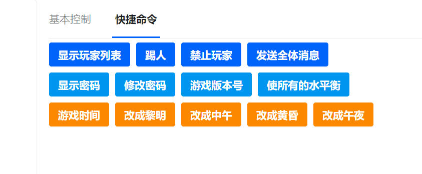

# 泰拉瑞亚服务器控制面板

## 运行

直接使用docker来启动，命令如下，`SERVER_TOKEN`是服务密码
```bash
sudo docker run -itd -p 3000:80 -p 7777:7777 -e "SERVER_TOKEN=xiaoyou" xiaoyou66/terraria:v1.0
```

然后我们打开`3000` 这个端口即可启动服务，第一步是设置一下服务密码



然后我们编辑一下世界



最后点击开始游戏就可以了



除了基本控制，还有一些快捷命令

